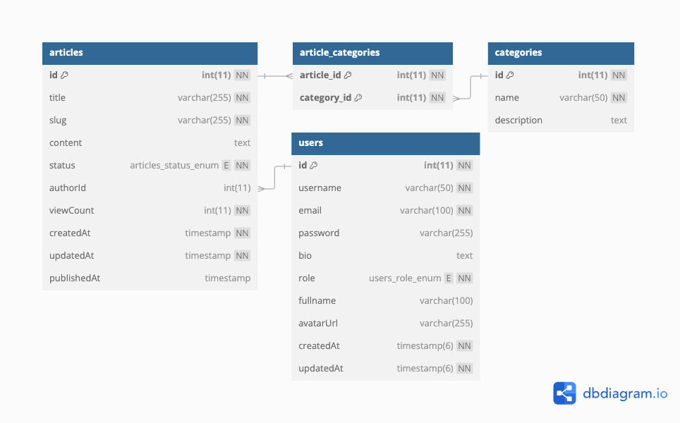

<p align="center">
  <a href="http://nestjs.com/" target="blank"></a>
</p>

[circleci-image]: https://img.shields.io/circleci/build/github/nestjs/nest/master?token=abc123def456
[circleci-url]: https://circleci.com/gh/nestjs/nest

  <p align="center">A progressive <a href="http://nodejs.org" target="_blank">Node.js</a> framework for building efficient and scalable server-side applications.</p>
    <p align="center">
<a href="https://www.npmjs.com/~nestjscore" target="_blank"></a>
<a href="https://www.npmjs.com/~nestjscore" target="_blank"></a>
<a href="https://www.npmjs.com/~nestjscore" target="_blank"></a>
<a href="https://circleci.com/gh/nestjs/nest" target="_blank"></a>
<a href="https://coveralls.io/github/nestjs/nest?branch=master" target="_blank"></a>
<a href="https://discord.gg/G7Qnnhy" target="_blank"></a>
<a href="https://opencollective.com/nest#backer" target="_blank"></a>
<a href="https://opencollective.com/nest#sponsor" target="_blank"></a>
  <a href="https://paypal.me/kamilmysliwiec" target="_blank"></a>
    <a href="https://opencollective.com/nest#sponsor"  target="_blank"></a>
  <a href="https://twitter.com/nestframework" target="_blank"></a>
</p>
  <!--[](https://opencollective.com/nest#backer)
  [](https://opencollective.com/nest#sponsor)-->


## Project Goals 🎯

This project was created to tackle the challenge presented in the internship listing at DOT Malang 2024 Batch 3 as a Backend Developer. In this project, I aimed to build an efficient and scalable application, with a good architecture and clear documentation. Below is the database design used:



## Prerequisites 🔧

Before getting started, make sure you have the following installed on your machine:

- **Docker**: To run the application in containers.
- **Node.js**: The latest version to ensure compatibility.

## Installation Steps 🚀

Follow the steps below to install the project:

1. Clone this repository:
   ```bash
   git clone https://github.com/MuliaHartawan/dot-articles-test.git
   cd dot-articles-test
   ```
````

2. Build and run with Docker:

   ```bash
   make run-app
   ```

3. Access the application at `http://localhost:3000`

## API Documentation 📚

For more information on how to use the API, you can access:

- Documentation folder: `docs/api.md`
- Swagger UI: [http://localhost:3000/api/v1/api-list](http://localhost:3000/api/v1/api-list)

## Future Vision 🌟

As an amateur Backend Developer, I want to continue sharpening my skills and knowledge in software development. I want to get a deeper understanding of system architecture, database optimization, and best practices in API development. With a strong passion for learning, I hope to contribute significantly to future projects and become a reliable professional in the industry. 🌟

Thank you for checking out this project! If you have any questions, feel free to contact me. 😊

```

## License

Nest is [MIT licensed](LICENSE).

